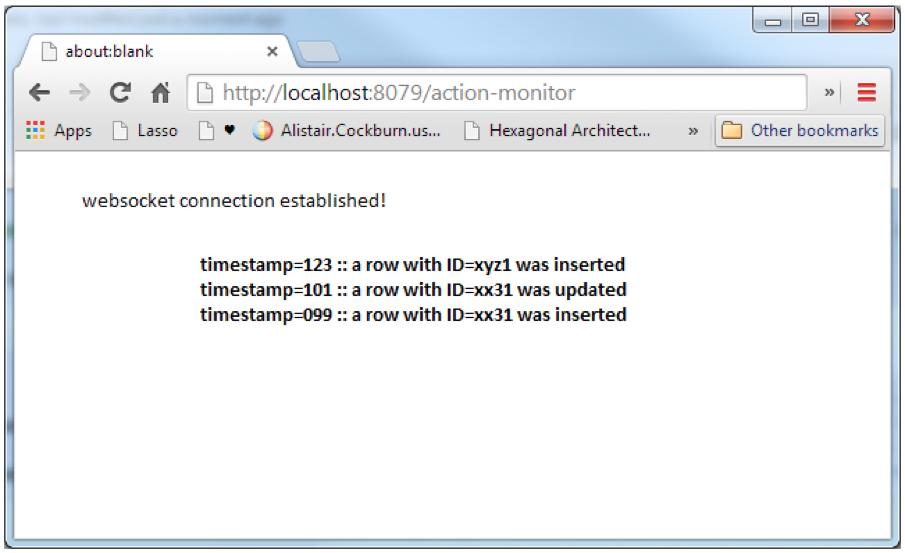

# BVTech assessment

author: Zoltan Domahidi  
date: 30th of July, 2018  

## Action-Monitor Application

### Build an application fulfilling the following requirements.

1. The app must be written in Java.  
Using the following libraries/ frameworks/ containers is optional but if used, it
will be appreciated.

2. The app should monitor the inserts in a database table and notify all the
browsers with a session established every time the contents of the table
change.  
- Maven
- Tomcat
- Spring (core, mvc, integration)
- SL4j + Logback (for logging purposes)
- A lightweight database
- WebSockets - Spring
- ActiveMQ
- EasyMock, Mockito or similar

### Bonus Points
Expose two REST endpoints returning:
- OK - if the application is running
- Version of the application

### Submission
- Submit your source code along with A README file detailing how to build and
deploy the code or other detail you find relevant.
- You can use any web-based service for version control to host and share your
solution.

### Points to take into consideration
- Make sure we can easily build and run the app.
- Make it easy for us to exercise the system (interacting with the database you
choose inserting/ updating rows).
- We will be looking at the code, assessing style, implementation and test
coverage.

__Important Note__: Even if you are not able to complete the exercise, if you feel that
whatever you achieve will give us an idea on the way you think and code, submit your
effort anyway. We also take into consideration the decisions given the time constraints.